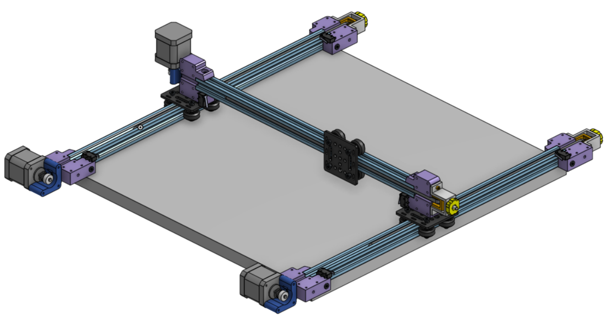
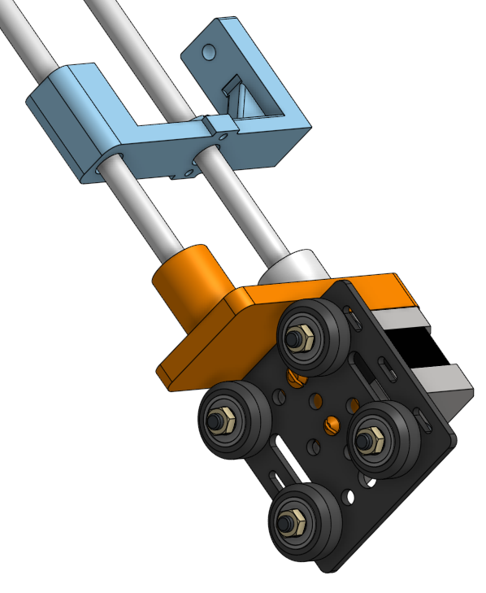

# **ScrewTron: Automated Gantry-Based Screwing System**
|||
:-------------------------:|:-------------------------:|

<p align="center">
  
</p>

## Table of Contents
1. [Problem Statement](#problem-statement)
2. [Our Solution](#our-solution)
   - [LED Panel Configuration](#led-panel-configuration)
   - [Critical Requirements](#critical-requirements)
3. [Features](#features)
4. [Prerequisites](#prerequisites)
5. [Repository Structure](#repository-structure)
6. [Installing](#installing)
7. [Hardware Architecture](#hardware-architecture)
8. [Future Goals](#future-goals)
9. [Authors](#authors)
10. [Acknowledgments](#acknowledgments)

---


## Problem Statement

**ScrewTron** addresses the challenge of automating the precise handling of **~280 miniature screws (1 mm size)** on sensitive LED panels. The system must operate with extreme precision around delicate circuitry while maintaining high-speed performance.

## Our Soultion

An advanced automated gantry system designed for precision screwing and unscrewing of miniature screws on delicate LED panels with sub-millimeter accuracy and high-speed operation.

[CAD MODEL](https://cad.onshape.com/documents/f8e877963d969bd52a009480/w/ae625ac84bd115da8b87aa91/e/6dbc831cc6b275fe37f96716) (Our CAD files)

### LED Panel Configuration

The target LED panel consists of two distinct layers:

* **Top Layer:** Contains **200 screws** - must be removed first during disassembly
* **Bottom Layer:** Contains **80 screws** - accessible only after top layer removal

**Installation Process:** Follows reverse order (bottom layer first, then top layer)

### Critical Requirements

Given the proximity to sensitive circuitry, the system must ensure:

- Sub-millimeter positioning repeatability
- Precise force control to prevent damage
- Accurate screw orientation detection
- Zero tolerance for misalignment
- Complete each screwing/unscrewing operation in **under 5 seconds**

## Features

- **High-precision 3-axis gantry system** (X, Y, Z axes)
- **Specialized toolhead** with automated screw feeding mechanism
- **Sub-millimeter positioning accuracy**
- **Integrated safety systems** for delicate component protection
- **High-speed operation** (<5 seconds per screw)
- **Automated screw orientation** ensuring correct placement

### Prerequisites

Hardware requirements:
- ESP32 development board
- DRV8825 stepper motor drivers (3x for X, Y, Z axes)
- Nema 17 Stepper motors (3x for gantry movement)
- Power supply (appropriate voltage/current for your stepper motors)
- Mechanical components (rails, belts, pulleys, frame, etc)

Software used:
- [ESP-IDF](https://docs.espressif.com/projects/esp-idf/en/latest/esp32/get-started/) (development framework) 
- [KiCad](https://www.kicad.org/) (for PCB modifications)
- [Onshape](https://www.onshape.com/) (for Mechanical Design)
- Git for version control.

### Repository Structure

```
Eklavya_Gantry
├── Docs/
├── Firmware/
│   ├── DRV8825/                   #Code for Running the system on DRV8825   
│   │   ├── circle/
│   │   ├── Double_axes/
│   │   ├── final/
│   │   ├── go_to_pos/
│   │   ├── homing/
│   │   ├── limit/
│   │   ├── SRA/
│   │   ├── step_func/
│   │   ├── stepper_test/
│   │   ├── totalhoming/
│   │   └── total_positioning/
│   ├── TMC2208/                   #Code for Running the system on TMC2208
│   │   ├── Go_to_pos/
│   │   ├── step_func/
│   │   └── uart/
│   │       ├── nmea0183_parser/
│   │       ├── uart_async_rxtxtasks/
│   │       ├── uart_echo/
│   │       ├── uart_echo_rs485/
│   │       ├── uart_events/
│   │       ├── uart_repl/
│   │       └── uart_select/
│   └── Screwdriver/               #Code for operating the toolhead
│       └── Screw/
├── Mechanics/
│   .
│   .
│   └── STL files for 3D Printed parts
├── pcb2/
|   .
|   .
|   └── KiCad Files for PCB
└── README.md

```

### Installing

Step-by-step setup process:

1. **Clone the repository**
```bash
git clone https://github.com/av-codes-lgtm/Eklavya_Gantry.git
cd Eklavya_Gantry
```

2. **Build and flash firmware**

Go to the folder with the code you want to flash to the esp using 

```bash
cd /Eklavya_Gantry/Firmware/folder-of-your-choice
```

and then run the following code

```bash
idf.py build flash monitor
```

## Hardware Architecture

| Component | Description |
|-----------|-------------|
| [ESP32](https://www.espressif.com/en/products/socs/esp32) | Main microcontroller with WiFi/Bluetooth capability |
| [DRV8825 Stepper Drivers](https://www.pololu.com/product/2133) | High-performance microstepping motor drivers |
| Nema 17 Stepper Motors | Precision motors for X, Y, Z axis control |
| Custom PCB | Integrated control and driver circuitry (under development) |

## Future Goals
- Shift to TMC2208 stepper drivers for better current handling and power distribution. DRV8825 does not work for prolonged time periods.
- Finalising the circuitry and shifting completely to PCB.
- Fine tuning the screw in and screw out processes to achieve industry grade quality screwing.
- Add a screw feeding system for the "screwing in" process.
- Creating a feedback mechanism to verify Screwing and unscrewing
- Creating a UI (Either WebPortal or build in software controlled using Raspberry Pi and a small screen) to make operation of the system simpler.
## Authors
*  *Firmware and Hardware setup*- [Aryan_Vyapari](https://github.com/av-codes-lgtm)
*  *PCB Design and tool-head operation* - [Sarvaarth_Narang](https://github.com/SarvaarthN)
*  *Firmware and Hardware setup* - [Pushkar_Dube](https://github.com/pushkardube)  

See the list of [contributors](https://github.com/av-codes-lgtm/Eklavya_Gantry/graphs/contributors) who participated in this project.
## Acknowledgments

* Thanks to the ESP-IDF, KiCad and Onshape community for excellent development tools
* Inspiration from industrial automation and precision manufacturing
- Thanks to our Robotics Club [SRA-VJTI](https://github.com/sra-vjti)  
* Special thanks to our senior mentors [Amey_Tikhe](https://github.com/AmeyaTikhe)  &  [Varun_Nigudkar](https://github.com/fluffysunfish?tab=overview&from=2024-12-01&to=2024-12-31)  

---

**For technical support, feature requests, or bug reports, please open an issue on GitHub.**
